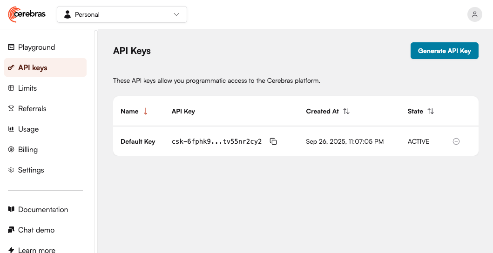
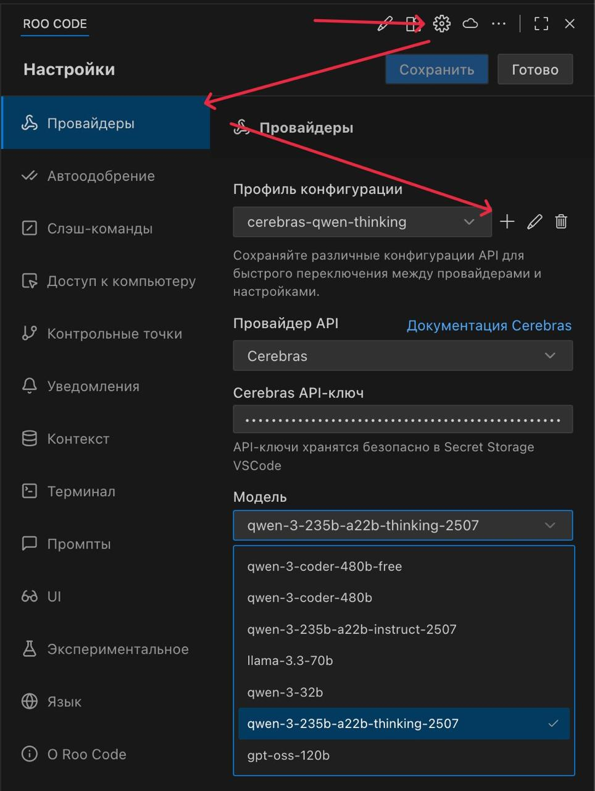

# Мастер-класс по исследованию ИИ-агентов на примере калькулятора

Этот мастер-класс посвящен исследованию возможностей ИИ-агентов для работы с кодом на примере веб-калькулятора с REST API.

## Подготовка и настройка окружения

### 1. Настройка VSCode и RooCode

1. Установите [VSCode](https://code.visualstudio.com/)
2. Установите [RooCode](https://marketplace.visualstudio.com/items?itemName=RooVeterinaryInc.roo-cline) - обязательное расширение для работы с ИИ-агентами
3. (Опционально) Установите рекомендуемые VSCode расширения для Python

#### Настройка моделей в RooCode
Для демонстрации используется сервис Cerebras AI с большими квотами — https://cloud.cerebras.ai/

1. Зарегистрируйтесь на сервисе и создайте организацию
2. В меню API Keys создайте и скопируйте ключ доступа

3. В VSCode откройте настройки RooCode (вкладка "Провайдеры")
4. Создайте новый профиль конфигурации:
   - Провайдер API: Cerebras
   - Cerebras API-ключ: вставьте скопированный ключ
   - Модель: выберите любую, кроме qwen-coder-480b (...480b-free можно). Я для себя настроил по профилю на каждую модель, чтобы удобнее было переключаться.


### 2. Получение кода проекта

1. Проверьте наличие Git и установите при необходимости:

Проверьте установлен ли Git:
```bash
git --version
```

Если нет — [установите git](https://git-scm.com/downloads).

2. Клонируйте репозиторий с проектом:

```bash
git clone https://github.com/fortrest-jr/sqa25-calc-task.git
cd sqa25-calc-task
```


### 3. Настройка окружения проекта

1. Убедитесь, что у вас установлен uv, набрав в консоли:
    ```bash
    uv --version
    ```
    Если нет, [установите uv](https://docs.astral.sh/uv/getting-started/installation/)

2. Установите зависимости:
    ```bash
    uv python install
    uv venv
    uv pip install -r requirements.txt
    ```

3. Запустите приложение:
    ```bash
    uv run python app.py
    ```

## Задания для мастер-класса

TODO: задания появятся после мастер-класса

## Дополнительная информация

Здесь будут полезные ссылки и материалы для мастер-класса.
